# SDCND : Sensor Fusion and Tracking
This is the project for the second course in the  [Udacity Self-Driving Car Engineer Nanodegree Program](https://www.udacity.com/course/c-plus-plus-nanodegree--nd213) : Sensor Fusion and Tracking. 

## License
[License](LICENSE.md)

## Project Lineup and Setup
The project setup can be found in [README.md](https://github.com/udacity/nd013-c2-fusion-starter)

# Sensor Fusion and Object Detection
This project is done by using the Waymo Open Dataset's real-world data collected from lidar sensor. In this project, another data is used and it can be otained through [here] (https://drive.google.com/drive/folders/1IkqFGYTF6Fh_d8J3UjQOSNJ2V42UDZpO?usp=sharing). Below are the project's requirements that should be done by each section.

- Section 1: Extended Kalman Filter (EKF)
  - Implement EKF including appropriate system matrix, F and process noise, Q, for constant velocity motion model.
  - EKF is applied to a simple single target scenario with lidar only.

 

- Section 2: Track Management
  - Able to initialize the track from unassigned measurements
  - Track score and state are defined and implemented (In this case, 'starting', 'checking' and 'confirmed' is stated)
  - Old tracks are deleted for not updated tracks
  - New tracks able to track and delete automatically when the tracks are shown or disappered from the screen.

 

- Section 3: Data Association
  - Implement the nearest neighbour data association including association matrix
  - Implement a method that returns nearest track and measurements association
  - Implement gating method with chi-square distribution to reduce the complexity
  - No "ghost tracks" is shown and it is able to be deleted after several frames if apperaring

 

- Section 4: Camera Sensor Fusion 
  - Implement appropriate covariance matrix, R, from the camera measurements
  - Implement non-linear camera measurement model, h(x). The Jacobian H is given.
  - Implement a method that can check whether object is inside the FOV or not.

All the projects are run in Ubuntu20.04 machine with RTX 3060Ti GPU device. The running code for this project is 

<code> python loop_over_dataset.py </code>

## Section 1: Extended Kalman Filter (EKF)
There are some changes in 'loop_over_dataset.py' to run this section

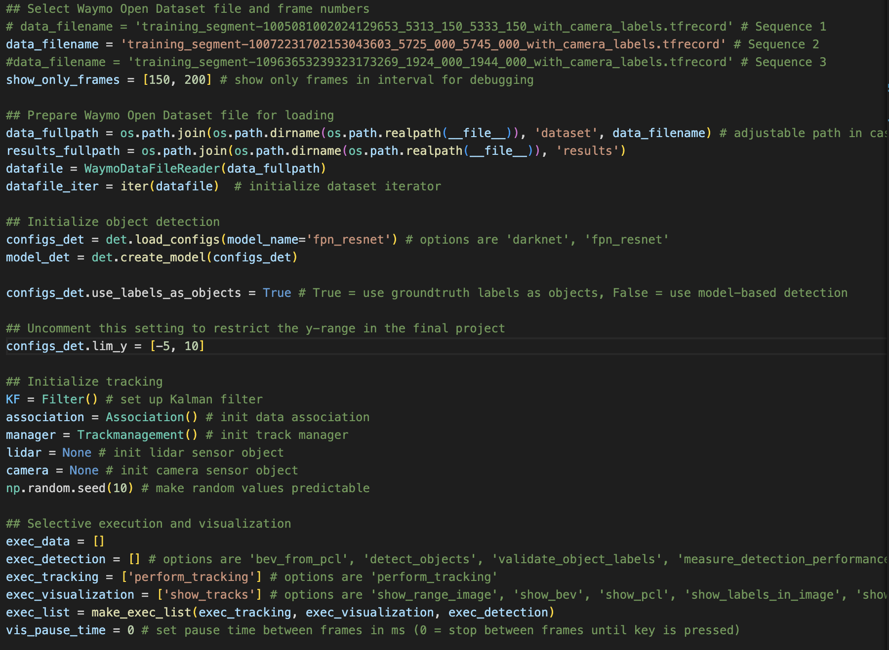

Also, there are changes in 'filter.py'. In this section, only the EKF is shown here.
In EKF, there are some function such as:
  - A matrix for 3D process model is calculated with constant velocity and noise covariance. At the same time, state h(x) and Jacobian, H, are calculated too.
  - The Kalman gain is calculated and used for updating the state and covariance.
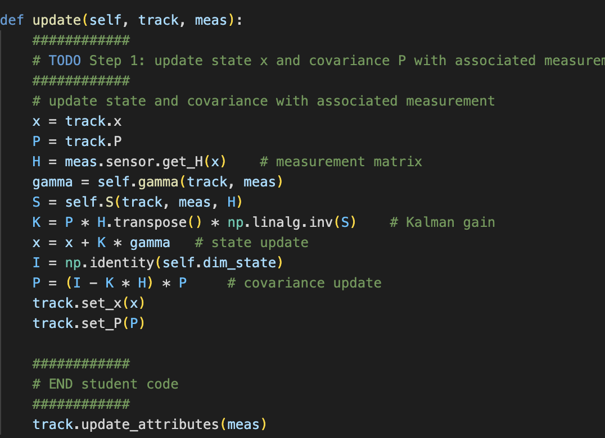

The analysis from graph and result for single tracking
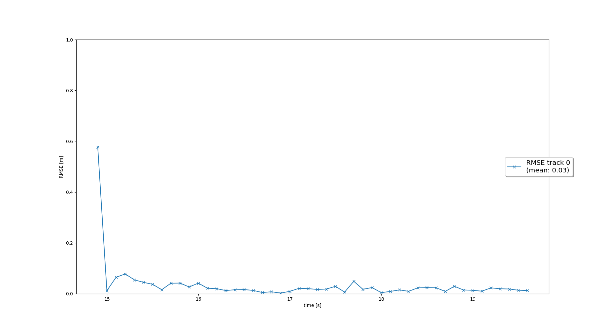
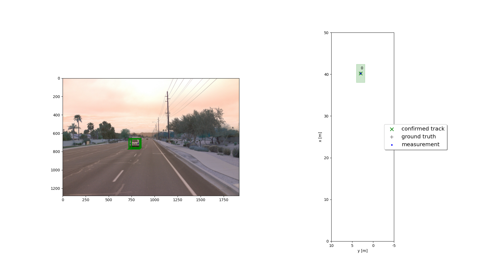

## Section 2: Track Management
These are the changes in 'loop_over_dataset.py' to run this section:
 
<code>
 show_only_frames = [65, 100]  
</code>
<code>
 configs_det.lim_y = [-5, 15] 
</code>
 
The other setup are same as Section 1.

Also, there are changes in 'trackmanagement.py'. The steps taken here as below:
  - The track is initialized with unassigned measurement calculation
  - If the scores on track is correlated, it will be increased, otherwise, vice versa
  - A track ranking is calculated and it will be compared to threshold stated. If it is greater than the threshold, it will be deleted. 
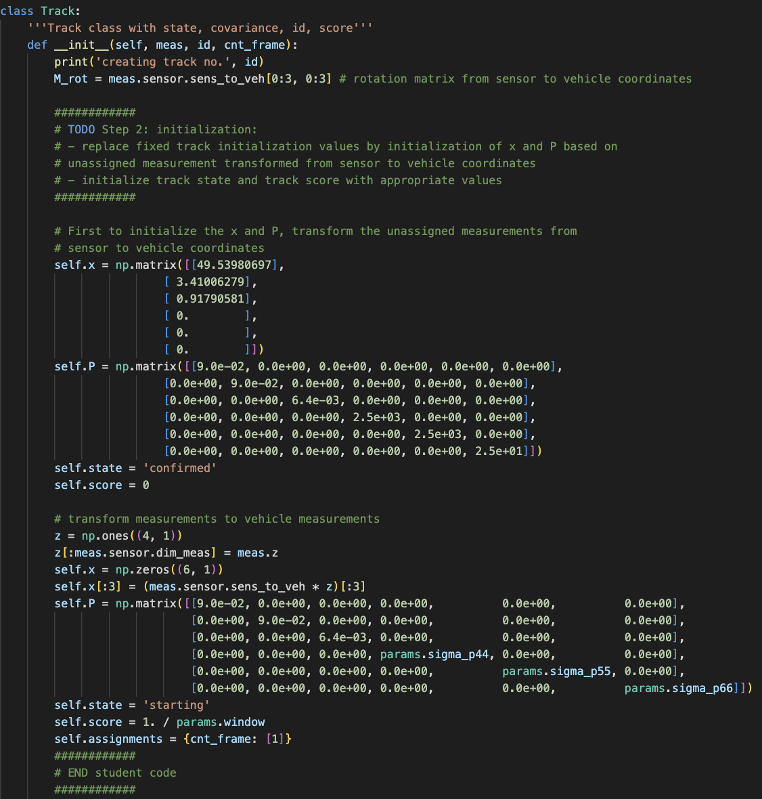

The analysis from graph and result for single tracking
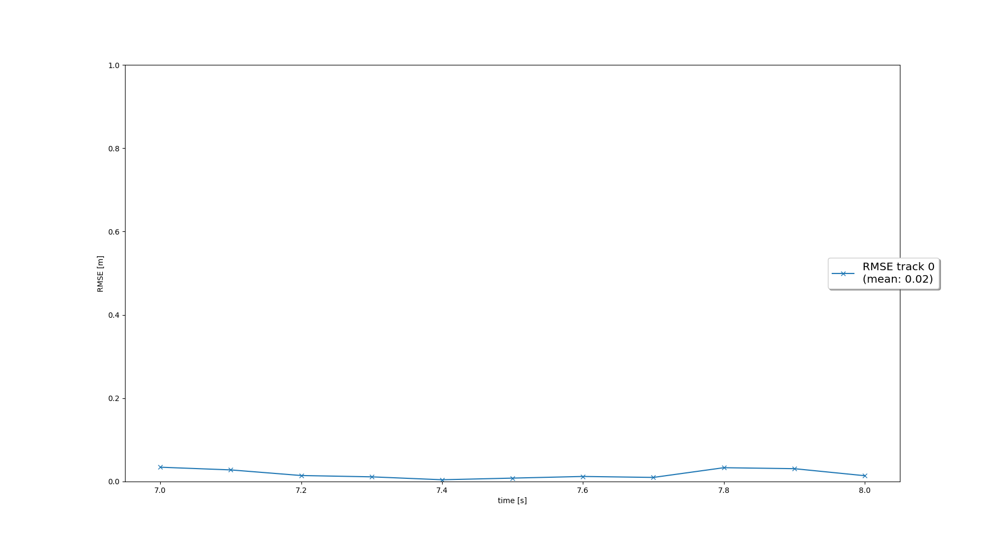
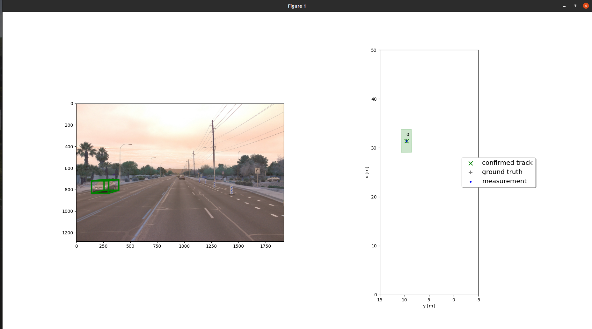

## Section 3: Data Association
To run this section, some changes are needed to be made in 'loop_over_dataset.py'. First, change the data sequence to Sequence 1 and the following:
 
<code>
 show_only_frames = [0, 200]  
</code>
<code>
 configs_det.lim_y = [-25, 25] 
</code>
 
Then the other setup are same as in Section 2.

Also, there are changes in 'association.py'. The steps for the code as below:
  - For all tracks, build a matrix and calculate the distance of Mahalanobis Distance(MHD) for each track measurement.
  - Using the Chi-Square method as the distribution, choosing the smallest MHD, update the Kalman Filter and delete the corresponding matrix for the 'ghost track'
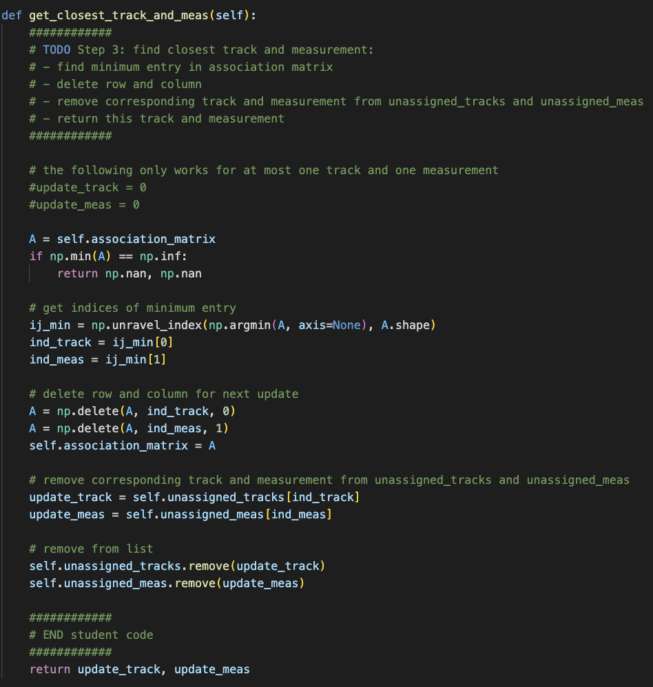
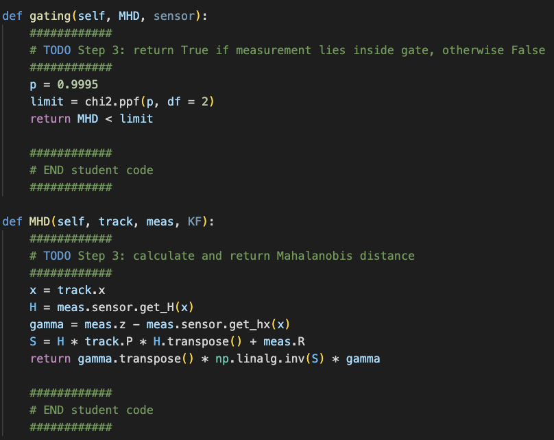

The analysis from graph and result are shown.
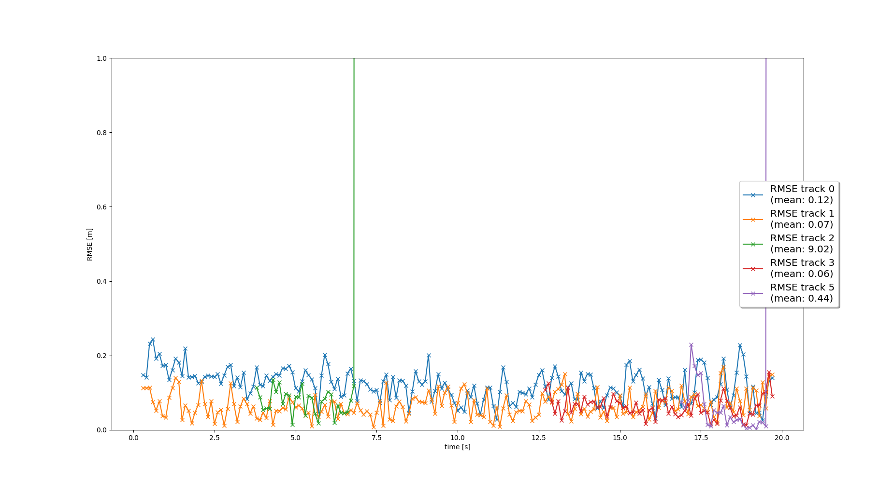
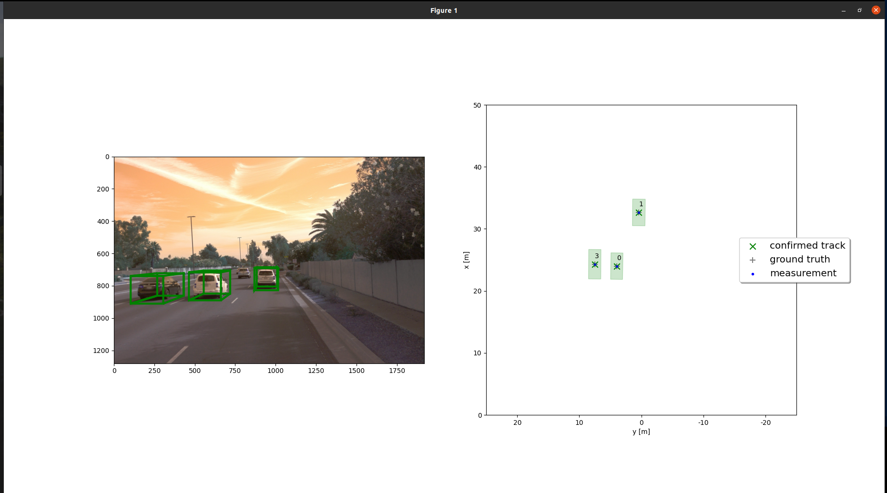

## Section 4: Camera Sensor Fusion
The steps for running this section is same as Section 3.

There are some changes in 'measurements.py'. The steps for the code as below:
  - Implements a matrix to convert the points from 3D space to 2D geometry as if in real life world
  - The calculation for FOV is done for the tracks, if within the FOV, the track will be accepted else it will be deleted
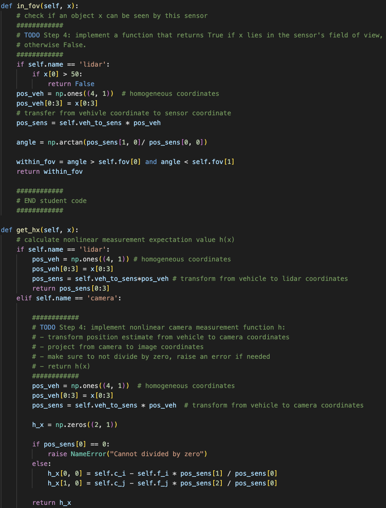

The analysis from graph is shown.
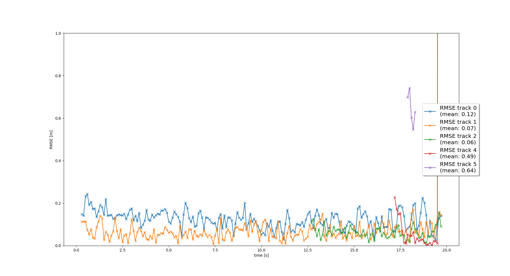

## Difficulties
All the project flows are well guided and planned. However, there are some difficulties I have faced when going through this title's project. For example, if using the local computer for running the code, the version of the library is unknown. It needs a lot of time to debug and find the correct version of library in order to run the programs without problems. Besides, a very large pre-computed results are needed to download and placed in the correct path. However, it is too much and difficult to find the path for the designated section to run for the corresponding pkl file. In this project, each sequence pkl file is seperated in different file for easier to allocate, but it makes trouble to read the pkl file as a lot of changes needed to be done in the main loop file to search for the correct path. 

## Benefits in Camera-Lidar Fusion Tracking over Lidar-only Tracking
Throughout this project, it is clearly differentiating the advantages and disadvatages of camera and Lidar sensor. If one of them is working alone, there will be some limitations for each sensor. For example, the camera sensor is good at providing the image based information such as color, brightness and contrast; the Lidar sensor is good at providing the information in environmental conditions such as good/bad weather or good/bad visibility. For combining with the computer vision purpose, Lidar-only sensor is not enough in providing the information to train with Complex-YOLO architecture, but with the camera sensor as the sub-equipment to provide the 2D geometry matrix, it makes both sensors can perform well detection for the auto-driving system.

## Real Life Challeges
As mentioned in the project, measurements and noise covariance are the essential variables for the tracking purpose. For multiple tracking, instead of using the standardized covariance for all the tracking, it is better to have corresponding covariance for each of the tracking so that there won't be have the issue of wrong correlation. Also, the threshold of the gating should be set properly to avoid the wrong correlation is real-life world tracking. Fine-tuned method is good for the result of Resnet architecture to find the most precise parameter for the camera and Lidar sensor to track the objects. Meanwhile, in this project, vehicles only are tracked, but there are more objects in real life such as pedestrians, cyclist, obstacles and so on to be detected so that it can complete for auto-drving system.

## Improvement
As stated before, not only vehicles, the dataset should include other objects should be added so that it makes to be real in the world. Also, the pre-computed results are too simple to get it as provided for the object. It is better to have the training with Complex-YOLO architecture to get the corresponding results. With the current result, it can only know how to do for tracking from 3D point cloud to 2D geometric and the simple object detection, but the direction of the vehicles are still unknown. (Future movement such as turn right, turn left, moving straight and so on)
